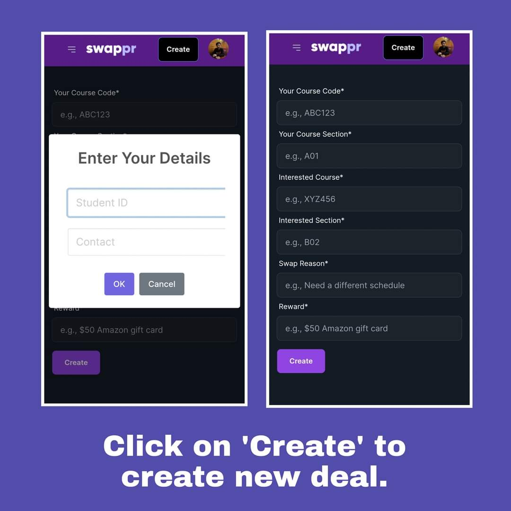
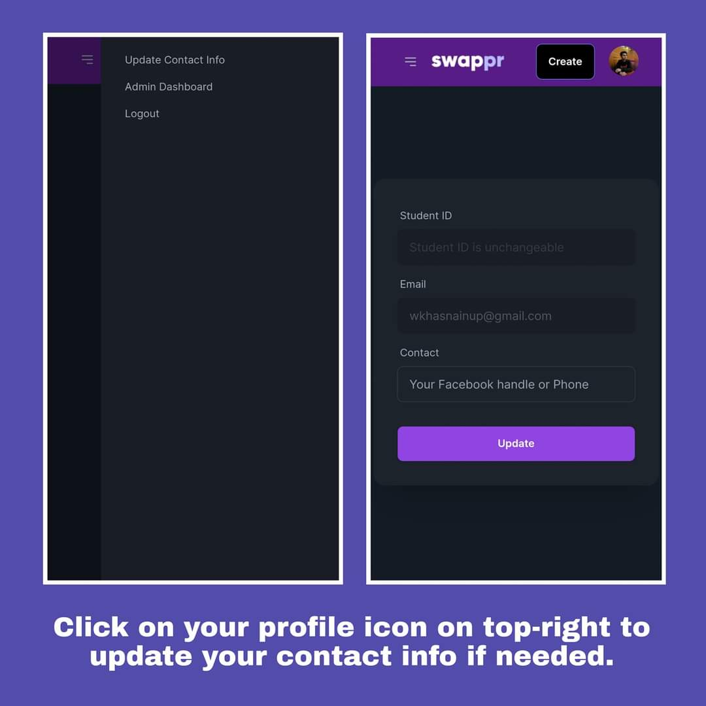

# Swappr

Swappr is an online platform designed to simplify and enhance the course-swapping process for students at BRAC University. The platform allows students to easily connect with peers who are looking to swap courses, making the process more efficient and user-friendly.

## Table of Contents

- [Features](#features)
- [Installation](#installation)
- [How to Use](#how-to-use)
- [Contributing](#contributing)
- [License](#license)
- [Contact](#contact)

## Features

- **User Registration and Login**: Secure registration and login system for BRACU students.
- **Search and Filter**: Find available courses and potential swaps using search and filter options.
- **Manage Your Swap Posts**: Manage your swap posts/deals on the go.

## Installation

To set up Swappr locally, follow these steps:

1. **Clone the repository**:
    ```bash
    git clone https://github.com/axif0/swappr.git
    ```
2. **Navigate to the project directory**:
    ```bash
    cd swappr
    ```
3. **Install dependencies**:
    ```bash
    npm install
    ```
4. **Set up the database**:
    - Create a database for the project.
    - Update the database configuration in the `.env` file.

5. **Run the application**:
    ```bash
    npm start
    ```

#### You can find the backend [here](https://github.com/axif0/swapper-server).

## How to Use

1. **Register** on the platform using your BRACU student credentials.
2. **Login** and navigate through the platform using the navigation menu.

   

3. **Create a Swap Post** to offer a course for swapping.

   

4. **Manage Your Deals** through the "My Deals" section to keep track of your active swap requests.

   

5. **Browse Available Deals** to find courses that others have listed for swapping.

   

6. **View and Edit Your Profile** to manage your personal information.

   

## Contributing

We welcome contributions to Swappr! If you have suggestions or find a bug, please open an issue or submit a pull request.

To contribute:

1. Fork the repository.
2. Create a new branch (`git checkout -b feature/YourFeatureName`).
3. Make your changes and commit them (`git commit -m 'Add some feature'`).
4. Push to the branch (`git push origin feature/YourFeatureName`).
5. Open a pull request.

## License

This project is licensed under the MIT License - see the [LICENSE](LICENSE) file for details.

## Contact

For any questions or feedback, please reach out to us:

- **Email**: wkhasnainup@gmail.com
- **Website**: [swappr.web-app.com](https://swappr.web-app.com)